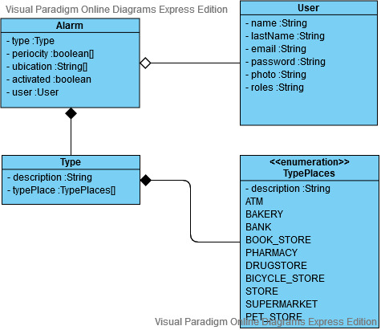

# AlarmMe
Proyecto final del ciclo 2º Desarrollo de Aplicaciones Multiplataforma 2020 del centro Salesianos Triana.

Realizado por:

* [Jose Manuel Bargueño](https://github.com/JMBargueno)
* [Esperanza Macarena Escacena](https://github.com/EsperanzaMacarena)
<br/><br/>
<br/><br/>


## Documentación del seguimiento del proyecto final.
---
Dadas las circunstancias causadas por el COVID-19 y las resoluciones e instrucciones publicadas en el mes de Marzo de 2020 por la Junta de Andalucía y por el Gobierno de España, se ha suspendido las clases presenciales en todas las etapas educativas, causando que el siguimiento de los proyectos finales de nuestra etapa sea de forma telemática.

Para ello, el equipo docente de Salesianos Triana ha marcado una serie de documentación a realizar en diferentes fechas de entrega y es por ello por lo que esta documentación se articulará con los siguientes documentos:


1. [Descripción detallada del sistema](#DDS)
2. [Documento de historias de usuario](#DHU)
3. [Diagrama UML de AlarmMe API](#UML)
4. [Modelo de la Base de Datos de AlarmMe en MongoDB](#DB)
4. [Sketching web y android](#SKETCHING)
5. [Documentación de rutas AlarmMeAPI](#ROUTES)
6. [Proyecto de empresa](#EMPRESA)
7. [Informes de seguimiento del proyecto](#SEGUIMIENTO)
<br/><br/>
<br/><br/>


## Descripción detallada del sistema.<a name="DDS"></a>
---
AlarmMe se configura a través de tres aplicaciones:

### API REST AlarmMe
Aplicación realizada con NodeJs, Express y MongoDB. Se realizarán los métodos básicos CRUD de los modelos User, Alarm y Type, además de los convenientes para la ejecución de los requisitos mínimos del sistema.

### AlarmMe Web
La aplicación Web está realizada con Angular Material y está diseñada para el administrador de AlarmMe.

En esta aplicación podremos:

* Listar usuarios
* Deshabilitar usuarios
* Listar tipos de alarmas: Estas serán las alarmas predefinidas por el sistema, como por ejemplo: Comprar pan.
* Crear un tipo de alarma
* Modificar un tipo de alarma
* Eliminar un tipo de alarma

El usuario administrador será predefinido, a saber:

    Fullname: John Smith
    Email: admin@administrador.com
    Password: 12345678

### AlarmMe App
La aplicación de Android de AlarmMe permite registrar alarmas asociadas a tareas cotidianas, como por ejemplo: comprar el pan, ir al supermercado o sacar dinero. La alarma sonará cuando esté cerca del establecimiento idóneo para realizar esa tarea. Es decir, que si mi alarma es para comprar el pan y estoy acercándome a una panadería o un supermercado, la alarma me avisará de la proximidad de ese negocio y que debo comprar pan.

Para esta funcionalidad, se hará uso de [Places API](https://developers.google.com/places/web-service/intro?hl=es)

Otro tipo de alarma es la del tipo transporte. En este tipo el usuario podrá configurar una alarma cuando se acerque a su destino. Principalmente, esta funcionalidad, se configurará para la red de autobuses del Consorcio de Trasporte de Andalucía. De está forma el usuario podrá ir seguro y relajado al destino, sabiendo que le avisará nuestra app.

Para ello se consultará a la [API de la Red de Consorcios de Transporte de Andalucía](http://api.ctan.es/doc/).

Por último, el usuario podrá elegir un destino a su antojo en un mapa y se hará uso de [Google Maps Android API](https://developers.google.com/maps/documentation/android-sdk/intro).

Para usar la aplicación será necesario registrarse y loguearse.
<br/><br/>
<br/><br/>

## Documento de historias de usuario.<a name="DHU"></a>
---
| ID   |      Historia de usuario      | Usuario  | Esfuerzo  | Asignado a |
|------|:-----------------------------:|:--------:|:---------:|:----------:|
|01.1  | Inicio de sesión  Android     |  Usuario |     6     |E.M.Escacena|
|01.2  | Inicio de sesión  Angular     |  Admin   |     6     |J.M.Bargueno|
|02    | Registro Android              |  Usuario |     6     |J.M.Bargueno|
|03    | Crear alarma predefinida      |  Admin   |     6     |E.M.Escacena|
|04    | Modificar alarma predefinida  |  Admin   |     6     |E.M.Escacena|
|05    | Eliminar alarma predefinida   |  Admin   |     5     |E.M.Escacena|
|06    | Listar alarmas predefinidas   |  Admin   |     5     |E.M.Escacena|
|07    | Listar usuarios               |  Admin   |     5     |J.M.Bargueno|
|08    | Deshabilitar usuario          |  Admin   |     5     |J.M.Bargueno|
|09    | Listar alarmas                |  Usuario |     7     |J.M.Bargueno|
|10    | Crear/Modificar alarma predefinida      |  Usuario |    10     |E.M.Escacena|
|11    | Crear/Modificar alarma transporte       |  Usuario |    10     |J.M.Bargueno|
|12    | Crear/Modificar alarma personalizada    |  Usuario |    10     |E.M.Escacena|
|14    | Eliminar alarma               |  Usuario |     5     |J.M.Bargueno|
|16    | Cerrar sesión                 |  Usuario |     5     |J.M.Bargueno|
|17    | Subir foto de perfil          |  Usuario |     8     |E.M.Escacena|
|18    | Eliminar foto de perfil       |  Usuario |     6     |E.M.Escacena|
|19    | Modificar foto de perfil      |  Usuario |     7     |E.M.Escacena|
|20    | Modificar nombre              |  Usuario |     5     |J.M.Bargueno|
|21    | Modificar contraseña          |  Usuario |     6     |E.M.Escacena|
|22    | Cerrar sesión Angular         |  Admin   |     5     |J.M.Bargueno|

<br/><br/>

Otras tares inherentes a la realización de las historias de usuarios:
| ID   |      Tarea                    | Donde    | Esfuerzo  | Asignado a |
|------|:-----------------------------:|:--------:|:---------:|:----------:|
|100   | Modelo usuario                |   API    |     1     |J.M.Bargueno|
|101   | Modelo alarma                 |   API    |     1     |J.M.Bargueno|
|102   | Modelo tipo                   |   API    |     1     |J.M.Bargueno|
|103   | Endpoint usuario              |   API    |     10    |E.M.Escacena|
|104   | Endpoint alarm                |   API    |     10    |J.M.Bargueno|
|105   | Endpoint tipo                 |   API    |     5     |E.M.Escacena|
|106   | Authentication                |   API    |     6     |J.M.Bargueno|
|108   | Multer - peticiones multipart |   API    |     8     |E.M.Escacena|
|109   | Retrofit API AlarmMe          | Android  |     6     |E.M.Escacena|
|110   | Retrofit API GoogleMaps       | Android  |     6     |E.M.Escacena|
|111   | Retrofit API GooglePlaces     | Android  |     6     |E.M.Escacena|
|112   | Retrofit API Consorcios       | Android  |     6     |J.M.Bargueno|
|113   | Retrofit API Geocoding        | Android  |     6     |J.M.Bargueno|
|114   | Retrofit API Firebase         | Android  |     6     |J.M.Bargueno|
|115   | Servicio API AlarmMe          | Angular  |     6     |J.M.Bargueno|

<br/><br/>


Total de puntos de esfuerzo de cada alumno:

#### J.M. Bargueno
|      Donde    | Puntos    |
|:-------------:|:---------:|
| Angular       | 27        |
| Android       | 61        |
| API           | 24        |
| Total         | 112       |

#### E.M. Escacena
|      Donde    | Puntos    |
|:-------------:|:---------:|
| Angular       | 22        |
| Android       | 71        |
| API           | 23        |
| Total         | 116       |

<br/><br/>
<br/><br/>

## Diagrama UML de AlarmMe API.<a name="UML"></a>

<br/><br/>
<br/><br/>

## Modelo de la Base de Datos de AlarmMe en MongoDB.<a name="DB"></a>
```javascript
const userSchema = new Schema({
    email: {
      type: String,
      match: /^\S+@\S+.\S+$/,
      required: true,
      unique: true,
      trim: true,
      lowercase: true
    },
    password: {
      type: String,
      required: true,
      minlength: 6
    },
    fullname: {
      type: String,
      index: true,
      trim: true
    },
    role: {
      type: String,
      enum: roles,
      default: 'user'
    },
    picture: imgSchema,
    enabled: {
      type: Boolean,
      default: true
    },
  }, {
    timestamps: true
  })
```
```javascript
const typeSchema = new Schema({
    description: {
      type: String
    },
    typePlaces: {
      type: String,
      enum: [typePlaces],
      default: "UNKNOWN"
    },
    ubication: {
      type: String
    }
  })
```
```javascript
const alarmSchema = new Schema({
    createdBy: {
      type: Schema.Types.ObjectId,
      ref: 'User',
      required: true
    },
    type: {
      type: Schema.Types.ObjectId,
      ref: 'Type',
      required: false
    },
    done: {
      type: Boolean
    },
    activated: {
      type: Boolean
    }
  })
```
<br/><br/>
<br/><br/>

## Sketching web y android.<a name="SKETCHING"></a>
[Sketching](./Documentation/SketchingAlarmMe.pdf)
<br/><br/>
<br/><br/>

## Documentación de rutas de AlarmMeAPI.<a name="ROUTES"></a>
EN CONSTRUCCIÓN
<br/><br/>
<br/><br/>

## Proyecto de empresa AlarmMe.<a name ="EMPRESA"></a>
[Proyecto de empresa AlarmMe](./Documentation/ProyectoEmpresaAlarmMe_Bargueno_Escacena.pdf)
<br/><br/>
<br/><br/>

## Informes de seguimiento del proyecto.<a name ="SEGUIMIENTO"></a>

#### 17 Marzo 2020
[Informe 01](./Informes/Entrega_17032020/INF01_17032020.pdf)

#### 18 Marzo 2020
[DSP 01](./Informes/Entrega_18032020/DSP18032020.pdf)

[Colección Postman](./ApiAlarmMe.postman_collection.json)

[Datos de usuarios de prueba](./Informes/Entrega_18032020/DatosUsuarioAProbar.txt)

### 19 Marzo 2020
[DSP 02](./Informes/Entrega_19032020/DSP19032020.pdf)

### 20 Marzo 2020
[DSP 03](./Informes/Entrega_20032020/DSP20032020.pdf)
<br/><br/>
<br/><br/>
